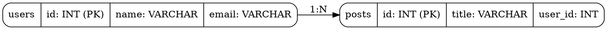

# 🔥 ER Diagram Generator

An AI-powered tool that analyzes GitHub repositories and automatically generates Entity-Relationship (ER) diagrams using **DOT language** and **Google Gemini AI**.

## ✨ Features

- 🔗 **Paste GitHub URL** → Get ER Diagram instantly
- 🤖 **AI-Powered** using Google Gemini
- 📊 **Multi-Framework Support**: SQL, Prisma, Sequelize, Mongoose, Django, Laravel, Rails
- 🎨 **DOT Format Output** (Graphviz compatible)
- 📥 **Export** as PNG, SVG, or DOT
- ⚡ **Fast & Accurate** schema extraction

## 🏗️ Tech Stack

### Frontend
- **Next.js 14** (App Router)
- **React** with TypeScript
- **Tailwind CSS** for styling
- **Viz.js** for DOT rendering

### Backend
- **Node.js** with Express
- **Google Gemini AI** for schema extraction
- **simple-git** for repository cloning
- **DOT Language** (Graphviz)

## 🚀 Quick Start

### Prerequisites
- Node.js v18+ installed
- Google Gemini API Key ([Get one here](https://ai.google.dev/))

### Installation

1. **Clone the repository**
```bash
cd ER-Project
```

2. **Set up Backend**
```bash
cd backend
npm install
cp .env.example .env
# Edit .env and add your GEMINI_API_KEY
```

3. **Set up Frontend**
```bash
cd ../frontend
npm install
```

### Get Your Gemini API Key

1. Go to [Google AI Studio](https://ai.google.dev/)
2. Click "Get API Key"
3. Create a new API key
4. Copy it to `backend/.env`:

```env
GEMINI_API_KEY=your_actual_api_key_here
```

### Run the Project

**Terminal 1 - Backend:**
```bash
cd backend
npm run dev
```

**Terminal 2 - Frontend:**
```bash
cd frontend
npm run dev
```

Then open [http://localhost:3000](http://localhost:3000) in your browser!

## 📖 How It Works

1. **User pastes** a GitHub repository URL
2. **Backend clones** the repo (shallow clone)
3. **Scanner detects** schema files (SQL, Prisma, models, etc.)
4. **Gemini AI** extracts database schema from code
5. **Converter** transforms schema to DOT format
6. **Viz.js renders** the ER diagram in the browser
7. **User can export** as PNG, SVG, or DOT file

## 🎯 Supported Frameworks

| Framework | Detection | Status |
|-----------|-----------|--------|
| SQL Files | `*.sql`, `migrations/*.sql` | ✅ |
| Prisma | `schema.prisma` | ✅ |
| Sequelize | `models/*.js` | ✅ |
| Mongoose | `models/*.js` with Schema | ✅ |
| Django | `models.py` | ✅ |
| Laravel | `app/Models/*.php` | ✅ |
| Rails | `app/models/*.rb` | ✅ |

## 📁 Project Structure

```
ER-Project/
├── frontend/          # Next.js application
│   ├── src/
│   │   ├── app/      # Pages and routes
│   │   ├── components/ # React components
│   │   └── lib/      # Utilities
│   └── package.json
├── backend/          # Express API
│   ├── src/
│   │   ├── routes/   # API endpoints
│   │   ├── services/ # Business logic
│   │   │   ├── gitService.js
│   │   │   ├── scannerService.js
│   │   │   ├── llmService.js (Gemini)
│   │   │   └── dotService.js
│   │   └── index.js
│   └── package.json
└── README.md
```

## 🌐 API Endpoints

### `POST /api/analyze`

Analyzes a GitHub repository and returns ER diagram.

**Request:**
```json
{
  "repoUrl": "https://github.com/username/repo"
}
```

**Response:**
```json
{
  "success": true,
  "repoUrl": "https://github.com/username/repo",
  "detectedTech": ["Prisma", "SQL"],
  "schema": { ... },
  "dotString": "digraph ERD { ... }",
  "tablesCount": 5
}
```

## 🎨 Example DOT Output



## 🔧 Troubleshooting

### "Gemini API key is not configured"
- Make sure you created a `.env` file in the `backend/` folder
- Add your API key: `GEMINI_API_KEY=your_key_here`

### "No schema files found"
- The repository might not have database models
- Try a different repo with clear database structure

### Port already in use
```bash
# Backend (port 5000)
lsof -ti:5000 | xargs kill

# Frontend (port 3000)
lsof -ti:3000 | xargs kill
```

## 🚀 Future Enhancements

- [ ] Support for more ORMs (TypeORM, Drizzle)
- [ ] Export to PNG/SVG directly from backend
- [ ] Compare ER diagrams between commits
- [ ] Interactive diagram editing
- [ ] Save and share diagrams
- [ ] API rate limiting and caching
- [ ] Docker support

## 📚 Learning Resources

- [Graphviz DOT Language](https://graphviz.org/doc/info/lang.html)
- [Google Gemini API](https://ai.google.dev/docs)
- [Viz.js Documentation](https://github.com/mdaines/viz-js)
- [Next.js Documentation](https://nextjs.org/docs)

## 📄 License

MIT License - feel free to use this for your projects!

## 🙌 Acknowledgments

- Built with ❤️ using Google Gemini AI
- Inspired by the need for automated ER diagram generation
- Perfect for students, developers, and database architects

---

**Made by:** Your Name
**Project Type:** Academic / Portfolio
**Status:** 🚀 Active Development
