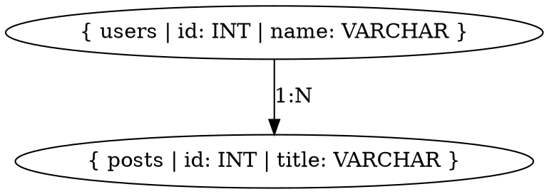

# 🎓 Student Guide: ER Diagram Generator Project

## 📚 What You'll Learn

This project teaches you:
- ✅ **Full-stack development** (Frontend + Backend)
- ✅ **Working with AI APIs** (Google Gemini)
- ✅ **Code analysis and parsing**
- ✅ **Graph visualization** (DOT/Graphviz)
- ✅ **Modern web design** (React, Tailwind)
- ✅ **API development** (RESTful APIs)
- ✅ **Git repository handling**

## 🛠️ Setup Instructions

### Step 1: Get Your Gemini API Key

1. Go to: https://ai.google.dev/
2. Click "Get API Key" button
3. Sign in with Google
4. Create a new API key
5. Copy the key (it looks like: `AIzaSy...`)

### Step 2: Configure Backend

1. Open `/backend/.env.example`
2. Create a copy named `.env`:
   ```bash
   cd backend
   cp .env.example .env
   ```
3. Edit `.env` and paste your API key:
   ```
   GEMINI_API_KEY=AIzaSyXXXXXXXXXXXXXXXXXXXXX
   ```

### Step 3: Install Dependencies

**Backend:**
```bash
cd backend
npm install
```

**Frontend:**
```bash
cd frontend
npm install
```

### Step 4: Run the Project

Open **TWO terminal windows**:

**Terminal 1 - Backend:**
```bash
cd backend
npm run dev
```
You should see: `🚀 Server running on http://localhost:5000`

**Terminal 2 - Frontend:**
```bash
cd frontend
npm run dev
```
You should see: `Local: http://localhost:3000`

### Step 5: Open in Browser

Go to: **http://localhost:3000**

## 🧪 Testing the Project

### Test with Example Repositories

Try these GitHub URLs in your application:

1. **Small Prisma Example:**
   ```
   https://github.com/prisma/prisma-examples
   ```

2. **Django Project:**
   ```
   https://github.com/django/django
   ```

3. **Laravel Project:**
   ```
   https://github.com/laravel/laravel
   ```

## 🏗️ Project Architecture Explained

```
User → Frontend (Next.js) → Backend API (Express) → Gemini AI
                                ↓
                         GitHub Repository
                                ↓
                         Schema Scanner
                                ↓
                         DOT Generator
                                ↓
                         Viz.js Renderer
```

### Backend Flow:

1. **gitService.js** - Clones GitHub repo
2. **scannerService.js** - Finds schema files (SQL, Prisma, etc.)
3. **llmService.js** - Sends code to Gemini AI
4. **dotService.js** - Converts schema to DOT format
5. **API returns** DOT string to frontend

### Frontend Flow:

1. User pastes GitHub URL
2. Sends to `/api/analyze` endpoint
3. Displays loading state
4. Receives DOT string + schema
5. Viz.js renders DOT → SVG
6. User can export diagram

## 📖 Code Explanation

### How Gemini Extracts Schema

The `llmService.js` sends this prompt to Gemini:

> "You are a database schema extraction expert. Analyze these code files and extract tables, columns, relationships in JSON format."

Gemini responds with:
```json
{
  "users": {
    "columns": { "id": "INT", "name": "VARCHAR" },
    "primaryKey": "id",
    "relations": { "posts": "1:N" }
  }
}
```

### How DOT Format Works

DOT is a graph description language. Example:



This creates:
- **Nodes** (rectangles) for tables
- **Edges** (arrows) for relationships

## 🎯 For Your College Project Report

### Problem Statement
"Manual creation of ER diagrams from code is time-consuming and error-prone. This project automates ER diagram generation from GitHub repositories using AI."

### Objectives
1. Automatically detect database schemas from code
2. Support multiple frameworks (SQL, ORMs)
3. Generate visual ER diagrams
4. Provide export functionality

### Technologies Used
- **Frontend:** Next.js 14, React, TypeScript, Tailwind CSS
- **Backend:** Node.js, Express
- **AI:** Google Gemini 1.5 Flash
- **Visualization:** Graphviz (DOT), Viz.js
- **Others:** simple-git, CORS

### Methodology
1. User inputs GitHub repository URL
2. Backend clones repository
3. File scanner detects schema files
4. Gemini AI extracts database structure
5. Schema converted to DOT format
6. Frontend renders visual diagram
7. User can export results

### Features
- ✅ Multi-framework support
- ✅ AI-powered extraction
- ✅ Real-time rendering
- ✅ Export as SVG/DOT
- ✅ Modern, responsive UI

### Future Enhancements
- Authentication system
- Save/share diagrams
- Compare versions
- More export formats
- Collaborative editing

## 🐛 Troubleshooting

### "Gemini API key not configured"
→ Make sure you created `.env` file (not `.env.example`) and added your key

### "Port 5000 already in use"
→ Kill the process:
```bash
lsof -ti:5000 | xargs kill
```

### "Cannot find module"
→ Run `npm install` again in both folders

### "No schema files found"
→ Try a different repository that has actual database models

### CORS Error
→ Make sure backend is running on port 5000 and frontend on port 3000

## 📝 Project Report Structure

1. **Abstract** - Summary of the project
2. **Introduction** - Problem statement and motivation
3. **Literature Survey** - Existing solutions
4. **System Design** - Architecture diagrams
5. **Implementation** - Code and screenshots
6. **Testing** - Test cases and results
7. **Conclusion** - Achievements and future work
8. **References** -Technologies used

## 🚀 Deployment (Optional)

### Frontend (Vercel):
```bash
cd frontend
npx vercel
```

### Backend (Render/Railway):
1. Push to GitHub
2. Connect to Render.com
3. Add environment variables
4. Deploy!

## 📚 Additional Resources

- Gemini API Docs: https://ai.google.dev/docs
- Graphviz DOT: https://graphviz.org/documentation/
- Next.js: https://nextjs.org/docs
- Express.js: https://expressjs.com/

## 💡 Tips for Presentation

1. **Start with a demo** - Show it working live
2. **Explain the problem** - Why manual ER diagrams are hard
3. **Show the tech stack** - Impress with modern technologies
4. **Demo the code** - Walk through key functions
5. **Discuss AI integration** - Highlight Gemini usage
6. **Show results** - Display generated diagrams
7. **Future scope** - What you'd add next

## ✅ Checklist Before Submission

- [ ] Project runs without errors
- [ ] README.md is complete
- [ ] Code is commented
- [ ] Screenshots taken
- [ ] Video demo recorded (optional)
- [ ] Project report written
- [ ] Presentation slides prepared

Good luck with your project! 🎉
